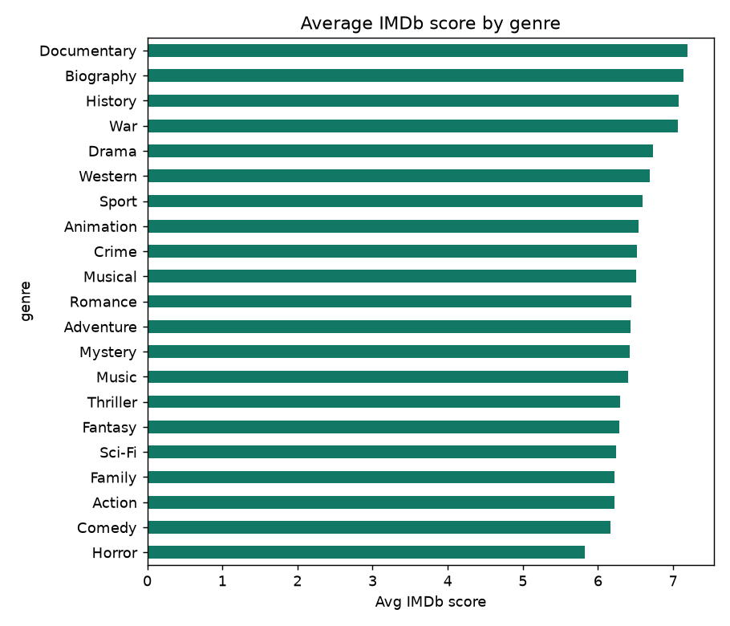

# 🎬 Movie Analytics on Microsoft Fabric

An end-to-end **Lakehouse analytics platform** built on **Microsoft Fabric**, taking raw movie data all the way from ingestion to a production-style **star schema** ready for Power BI.

The pipeline follows the **Medallion architecture** (Bronze → Silver → Gold), all orchestrated with **PySpark notebooks** inside a Fabric Lakehouse.

---

## 🏗️ Architecture

```
                 ┌──────────────┐     ┌──────────────┐     ┌───────────────────────┐
  Kaggle CSV ───▶│    BRONZE    │────▶│    SILVER    │────▶│         GOLD          │
  OMDb  API  ───▶│  raw ingest  │     │ clean & type │     │  star schema + aggs   │──▶ Power BI
  Simulated  ───▶│              │     │ normalize    │     │  dims + fact table    │
  ratings         └──────────────┘     └──────────────┘     └───────────────────────┘
```

| Layer | What happens | Key tables |
|-------|--------------|-----------|
| 🥉 **Bronze** | Raw ingestion of the CSV, the OMDb API responses, and generated user ratings, stored as Delta tables | `bronze_movies_metadata`, `bronze_omdb_api_ratings`, `bronze_user_ratings` |
| 🥈 **Silver** | Cleaning, IMDb-ID extraction from URLs, typing and normalization | `silver_movies_cleaned`, `silver_omdb_api` |
| 🥇 **Gold** | Star schema with surrogate keys, dimensions, aggregates and the fact table | `dim_movie`, `dim_user`, `fact_movie_ratings`, `gold_top_movies`, `gold_movie_rating_stats`, `gold_user_activity` |

---

## 📥 Data Sources

- **`movie_metadata.csv`** - a Kaggle dataset (title, duration, budget, IMDb score, …). Included in [`data/`](data/).
- **[OMDb API](https://www.omdbapi.com/)** - queried in a Python loop to enrich each film with its **director**.
- **Simulated user ratings** - generated from real IMDb IDs so the fact-table relationships are valid and realistic.

---

## ⭐ Gold model (star schema)

| Table | Description |
|-------|-------------|
| `dim_movie` | `imdb_id` + surrogate `movie_sk` |
| `dim_user` | `user_id` + surrogate `user_sk` |
| `fact_movie_ratings` | fact table: `user_sk`, `movie_sk`, `rating`, `rating_time` |
| `gold_top_movies` | top 50 films with ≥ 20 votes, ranked |
| `gold_movie_rating_stats` | average rating & vote count per film |
| `gold_user_activity` | total ratings + last activity per user |

---

## 🛠️ Tech Stack


Fabric Lakehouse · PySpark · Delta tables · OMDb API · pandas · Power BI

---

## 🚀 Reproduce it

1. Create a **Lakehouse** in Microsoft Fabric and upload `data/movie_metadata.csv` to `Files/`.
2. Import [`notebooks/lakehouse_movie_analytics.ipynb`](notebooks/lakehouse_movie_analytics.ipynb) and attach it to the Lakehouse.
3. Set your OMDb key as an environment variable (the notebook reads it, no key is hard-coded):
   ```python
   import os
   os.environ["OMDB_API_KEY"] = "your_free_key_from_omdbapi.com"
   ```
4. Run the notebook top to bottom - it builds every Bronze/Silver/Gold table.
5. Build the Power BI model on top of the Gold tables.

---

## 💻 Run it locally (no Fabric needed)

The Fabric notebook runs inside a Fabric workspace - so this repo also ships a **dependency-light local reproduction** of the exact same Bronze → Silver → Gold logic in pandas, runnable by anyone:

```bash
pip install pandas matplotlib
python local/pipeline.py
```

It reads [`data/movie_metadata.csv`](data/movie_metadata.csv), rebuilds the medallion layers, and writes the Gold tables to [`local/gold/`](local/gold/) plus charts to `assets/`.

There's also an interactive dashboard over the Gold tables:

```bash
pip install streamlit plotly pandas
streamlit run local/app.py
```

---

## 💡 Key insights (from the local pipeline, ~4,900 films)

- 💸 **Money doesn't buy ratings.** Budget correlates with IMDb score at just **0.03** - essentially zero. What *does* track with rating: number of votes (**0.43**), runtime (**0.34**) and gross (**0.20**).
- 🎭 **Genre matters.** **Documentary** is the highest-rated genre (avg **7.19**), while **Horror** sits lowest (**5.82**).
- 🎬 **Directors that consistently deliver** (≥5 films): **Christopher Nolan** tops the list at **8.43** avg.
- 📈 The pipeline also outputs rating-by-decade and a top-20 films table (with a minimum-votes threshold to filter noise).

> Note: very early decades (1910s-20s) show high averages off a handful of films - a small-sample effect, not a golden age.



---

## 📚 What this project demonstrates

- Designing a **Medallion (Bronze/Silver/Gold)** Lakehouse from scratch
- Cleaning and normalizing **semi-structured data** with PySpark
- **Enriching data via an external REST API** (OMDb)
- Building a complete **star schema** with surrogate keys and a fact table
- Delivering an analytics-ready model for **Power BI**

---

## 📄 License

Released under the [MIT License](LICENSE).
